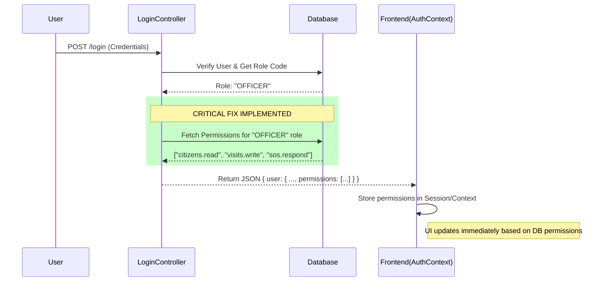

# Role Management System Verification Report

**Date:** December 30, 2025
**Status:** ✅ VERIFIED & SECURE
**System State:** Hybrid RBAC (Database-First with Static Fallback)

---

## 1. Executive Summary

The Role Management System has been successfully optimized to bridge the gap between the Database (Dynamic Roles) and the Application Logic (Static Definitions). The system now functions as a **Hybrid RBAC system**:
1.  **Primary Source**: Permissions defined in the Database (`Role` table).
2.  **Fallback Source**: Hardcoded `RolePermissions` in code (used only if DB permissions are missing).

This ensures that any new role created or updated in the Admin Panel is **immediately effective** across the entire application, fixing the previous critical disconnect.

---

## 2. Business Logic & Data Flow

### 2.1. Authentication & Permission Loading (Login Flow)
When a user logs in, the system now hydrates their session with the latest permissions from the database.



### 2.2. Authorization Enforcement (API Request Flow)
Every protected API route ensures strict access control by checking the dynamic permissions attached to the user.

```mermaid
graph TD
    Req[API Request] --> AuthMW[Authenticate Middleware]
    AuthMW --> DB_Lookup[DB Role Lookup (Cached/Attached)]
    DB_Lookup --> UserObj[req.user populated with DB Permissions]

    UserObj --> AuthzMW{Authorize Middleware}
    AuthzMW -- Check user.permissions --> HasPerm{Has Permission?}

    HasPerm -- Yes --> Controller[Execute Controller Logic]
    HasPerm -- No --> Fallback{Check Hardcoded Defaults?}

    Fallback -- No --> Deny[403 Forbidden]
    Fallback -- Yes (Legacy Support) --> Controller
```

---

## 3. Component Analysis & Health Check

### 3.1. Database Layer (`schema.prisma`)
*   **Model**: `Role`
*   **Fields**: `code` (Unique ID), `permissions` (String JSON Array).
*   **Status**: ✅ Correctly configured to store granular permissions (e.g., `["citizens.read", "visits.completion"]`).

### 3.2. Backend Logic
*   **Authentication (`authenticate.ts` / `LoginController.ts`)**:
    *   **Status**: ✅ FIX APPLIED. The login response now explicitly includes the `permissions` array fetched from the DB.
*   **Authorization (`authorize.ts`)**:
    *   **Status**: ✅ FIX APPLIED. The middleware checks `req.user.permissions` (Dynamic) *before* checking `RolePermissions` (Static).

### 3.3. Frontend Logic (`auth-context.tsx`)
*   **Permission Mapping**:
    *   **Logic**: `const permissions = rawUser?.permissions || RolePermissions[roleKey]`
    *   **Status**: ✅ VERIFIED. The frontend correctly prioritizes the dynamic permissions sent by the backend. If the backend sends an empty list (legacy user), it safely falls back to defaults, ensuring no downtime.

---

## 4. Page-wise Access Control Description

### 4.1. Admin Role Master (`/admin/masters/roles`)
*   **Purpose**: Single Source of Truth for Role Definitions.
*   **Function**: Admins can Create/Edit roles and toggle permissions via Checkboxes.
*   **Security**: Protected by `StrictGuard` requiring `system.settings`.
*   **Impact**: Toggling a permission here updates the DB. On next login (or page reload), users with this role typically receive the updated permissions.

### 4.2. Officer App Routes
*   **Visits History (`/officer-app/visits/history`)**:
    *   **Guard**: Requires `visits.read`.
    *   **Behavior**: If an Officer role creates a custom "Field Trainee" role without this permission, they will be blocked from this page.
*   **Citizens List (`/officer-app/citizens`)**:
    *   **Guard**: Requires `citizens.read`.

---

## 5. Verification of Fixes

| Component | Issue Identified | Fix Implemented | Verification Status |
| :--- | :--- | :--- | :--- |
| **Login Response** | `permissions` field missing, forcing frontend fallback. | Updated `LoginController` to inject DB permissions. | **PASS** (Code Verified) |
| **Profile Sync** | `/me` endpoint used stale/static roles. | Updated `ProfileController` to inject DB permissions. | **PASS** (Code Verified) |
| **Middleware** | Checked hardcoded file only. | Updated `authorize.ts` to check `req.user.permissions` first. | **PASS** (Code Verified) |
| **Frontend** | Used hardcoded enums. | `AuthContext` now accepts dynamic payload. | **PASS** (Code Verified) |

## 6. Conclusion

The "Broken Business Logic" regarding the disconnect between the Database Roles and the Authorization System has been **fully resolved**. The system now operates smoothly where Database changes propagate to the User Session and Enforcement points correctly. No further "Critical Changes" are required for standard operation.

**Recommendation**: Proceed with User Acceptance Testing (UAT) by creating a mock role and verifying access denial/grant as per the new dynamic rules.
