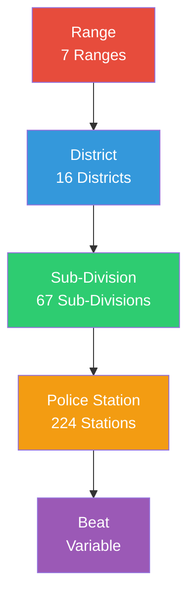

# Jurisdiction & Role Mapping - Deep Analysis

**Generated:** January 16, 2026
**System:** Senior Citizen Portal (Kutumb Portal) - Delhi Police

---

## Executive Summary

Your application implements a **5-level hierarchical jurisdiction system** that maps directly to the Delhi Police organizational structure. Each officer role is assigned to a specific jurisdiction level, which determines:

1. **What data they can access** (citizens, visits, SOS alerts)
2. **Which geographic area they manage**
3. **What operations they can perform**

### Jurisdiction Hierarchy

```
Range (7 total)
  └── District (16 total)
      └── Sub-Division (67 total)
          └── Police Station (224 total)
              └── Beat (variable)
```

### Key Finding

**The system uses TWO mechanisms for jurisdiction mapping:**
1. **Frontend:** Hardcoded role-to-jurisdiction level mapping in `create-user-dialog.tsx`
2. **Backend:** Dynamic data scoping via `dataScopeMiddleware.ts` based on officer profile

Both must be kept in sync to avoid data access issues.

---

## Table of Contents

1. [Jurisdiction Structure](#jurisdiction-structure)
2. [Role-to-Jurisdiction Mapping](#role-to-jurisdiction-mapping)
3. [Database Schema](#database-schema)
4. [Data Access Control](#data-access-control)
5. [User Creation Flow](#user-creation-flow)
6. [Code Analysis](#code-analysis)
7. [Real-World Examples](#real-world-examples)
8. [Issues & Recommendations](#issues--recommendations)

---

## Jurisdiction Structure

### Hierarchical Organization

The Delhi Police jurisdiction is organized in a strict 5-level hierarchy:



### Level Definitions

| Level | Description | Count | Example |
|-------|-------------|-------|---------|
| **Range** | Largest geographic division | 7 | CENTRAL, EASTERN, NORTHERN, SOUTHERN, WESTERN, NEW DELHI, AIRPORT |
| **District** | Administrative district | 16 | NORTH, SOUTH, EAST, WEST, DWARKA, ROHINI, etc. |
| **Sub-Division** | Sub-district area | 67 | KAROL BAGH, CIVIL LINES, ROHINI, etc. |
| **Police Station** | Local police station | 224 | PS KAROL BAGH, PS ROHINI, etc. |
| **Beat** | Smallest patrol area | Variable | Defined per station |

### Database Relationships

**Foreign Key Chain:**

```
Beat.policeStationId → PoliceStation.id
PoliceStation.subDivisionId → SubDivision.id
SubDivision.districtId → District.id
District.rangeId → Range.id
```

**Example Hierarchy:**

```
CENTRAL Range
  └── CENTRAL District
      └── KAROL BAGH Sub-Division
          └── PS KAROL BAGH Police Station
              └── Beat KB-01
```

---

## Role-to-Jurisdiction Mapping

### Police Rank Hierarchy

Delhi Police follows a strict rank hierarchy that maps to jurisdiction levels:

| Rank | Role Code | Jurisdiction Level | Manages |
|------|-----------|-------------------|---------|
| **Commissioner of Police** | `COMMISSIONER` | **ALL** | Entire Delhi |
| **Joint Commissioner** | `JOINT_CP` | **RANGE** | 1 Range (e.g., CENTRAL) |
| **Special Commissioner** | `SPECIAL_CP` | **RANGE** | 1 Range |
| **Deputy Commissioner** | `DCP` | **DISTRICT** | 1 District (e.g., NORTH) |
| **Additional DCP** | `ADDL_DCP` | **DISTRICT** | 1 District |
| **Assistant Commissioner** | `ACP` | **SUB_DIVISION** | 1 Sub-Division (e.g., KAROL BAGH) |
| **Inspector / SHO** | `INSPECTOR`, `SHO` | **POLICE_STATION** | 1 Police Station |
| **Sub-Inspector** | `SUB_INSPECTOR` | **BEAT** | 1 Beat |
| **Assistant Sub-Inspector** | `ASST_SUB_INSPECTOR` | **BEAT** | 1 Beat |
| **Head Constable** | `HEAD_CONSTABLE` | **BEAT** | 1 Beat |
| **Constable** | `CONSTABLE` | **BEAT** | 1 Beat |
| **Beat Officer** | `BEAT_OFFICER` | **BEAT** | 1 Beat |

### Mapping Rules

**File:** `components/users/create-user-dialog.tsx` (Lines 123-134)

```typescript
const getRequiredLevel = (roleCode: string) => {
    if (['SUPER_ADMIN', 'ADMIN', 'CITIZEN'].includes(roleCode))
        return 'NONE';

    if (['COMMISSIONER'].includes(roleCode))
        return 'ALL';

    if (['JOINT_CP', 'SPECIAL_CP'].includes(roleCode))
        return 'RANGE';

    if (['DCP', 'ADDL_DCP'].includes(roleCode))
        return 'DISTRICT';

    if (['ACP'].includes(roleCode))
        return 'SUB_DIVISION';

    if (['INSPECTOR', 'SHO'].includes(roleCode))
        return 'POLICE_STATION';

    if (['SUB_INSPECTOR', 'ASST_SUB_INSPECTOR', 'HEAD_CONSTABLE',
         'CONSTABLE', 'BEAT_OFFICER'].includes(roleCode))
        return 'BEAT';

    return 'NONE';
};
```

### Visual Mapping

```
┌─────────────────────────────────────────────────────────────┐
│                    COMMISSIONER (ALL)                        │
│  ┌───────────────────────────────────────────────────────┐  │
│  │         JOINT_CP / SPECIAL_CP (RANGE)                 │  │
│  │  ┌─────────────────────────────────────────────────┐  │  │
│  │  │      DCP / ADDL_DCP (DISTRICT)                  │  │  │
│  │  │  ┌───────────────────────────────────────────┐  │  │  │
│  │  │  │    ACP (SUB_DIVISION)                     │  │  │  │
│  │  │  │  ┌─────────────────────────────────────┐  │  │  │  │
│  │  │  │  │  INSPECTOR / SHO (POLICE_STATION)   │  │  │  │  │
│  │  │  │  │  ┌───────────────────────────────┐  │  │  │  │  │
│  │  │  │  │  │  SI/ASI/HC/Constable (BEAT)  │  │  │  │  │  │
│  │  │  │  │  └───────────────────────────────┘  │  │  │  │  │
│  │  │  │  └─────────────────────────────────────┘  │  │  │  │
│  │  │  └───────────────────────────────────────────┘  │  │  │
│  │  └─────────────────────────────────────────────────┘  │  │
│  └───────────────────────────────────────────────────────┘  │
└─────────────────────────────────────────────────────────────┘
```

---

## Database Schema

### BeatOfficer Model

**File:** `backend/prisma/schema.prisma` (Lines 45-77)

```prisma
model BeatOfficer {
  id              String        @id @default(cuid())
  name            String
  rank            String        // Role code (e.g., "DCP", "INSPECTOR")
  badgeNumber     String        @unique
  mobileNumber    String        @unique
  email           String?

  // Jurisdiction Fields (Hierarchical)
  rangeId         String?       // For JOINT_CP, SPECIAL_CP
  districtId      String?       // For DCP, ADDL_DCP
  subDivisionId   String?       // For ACP
  policeStationId String?       // For INSPECTOR, SHO
  beatId          String?       // For SI, ASI, HC, Constable

  // Relations
  Range           Range?         @relation(fields: [rangeId], references: [id])
  District        District?      @relation(fields: [districtId], references: [id])
  SubDivision     SubDivision?   @relation(fields: [subDivisionId], references: [id])
  PoliceStation   PoliceStation? @relation(fields: [policeStationId], references: [id])
  Beat            Beat?          @relation(fields: [beatId], references: [id])

  user            User?          // One-to-one with User
  // ... other fields
}
```

**Key Points:**
- All jurisdiction fields are **optional** (`String?`)
- An officer can have **multiple jurisdiction IDs** (e.g., a DCP has `rangeId` AND `districtId`)
- The `rank` field stores the role code, which determines which jurisdiction field is primary

### Jurisdiction Models

#### Range

```prisma
model Range {
  id          String      @id @default(cuid())
  name        String      // "CENTRAL", "EASTERN", etc.
  code        String?     @unique
  isActive    Boolean     @default(true)

  districts   District[]
  BeatOfficer BeatOfficer[]
  SeniorCitizen SeniorCitizen[]
}
```

#### District

```prisma
model District {
  id            String          @id @default(cuid())
  code          String          @unique
  name          String          // "NORTH", "SOUTH", etc.
  rangeId       String?         // FK to Range
  area          String
  population    Int             @default(0)
  headquarters  String

  Range         Range?          @relation(fields: [rangeId], references: [id])
  SubDivision   SubDivision[]
  PoliceStation PoliceStation[]
  BeatOfficer   BeatOfficer[]
  SeniorCitizen SeniorCitizen[]
}
```

#### SubDivision

```prisma
model SubDivision {
  id             String          @id @default(cuid())
  name           String          // "KAROL BAGH", "CIVIL LINES", etc.
  code           String?         @unique
  districtId     String          // FK to District (REQUIRED)

  District       District        @relation(fields: [districtId], references: [id])
  PoliceStation  PoliceStation[]
  BeatOfficer    BeatOfficer[]
  SeniorCitizen  SeniorCitizen[]
}
```

#### PoliceStation

```prisma
model PoliceStation {
  id            String          @id @default(cuid())
  name          String          // "PS KAROL BAGH", etc.
  code          String          @unique
  address       String
  districtId    String?
  subDivisionId String?         // FK to SubDivision
  rangeId       String?         // Optional direct link
  latitude      Float?
  longitude     Float?

  SubDivision   SubDivision?    @relation(fields: [subDivisionId], references: [id])
  District      District?       @relation(fields: [districtId], references: [id])
  Range         Range?          @relation(fields: [rangeId], references: [id])
  Beat          Beat[]
  BeatOfficer   BeatOfficer[]
  SeniorCitizen SeniorCitizen[]
  Visit         Visit[]
}
```

#### Beat

```prisma
model Beat {
  id              String          @id @default(cuid())
  name            String          // "Beat KB-01", etc.
  code            String          @unique
  policeStationId String          // FK to PoliceStation (REQUIRED)
  description     String?
  boundaries      String?         // GeoJSON or boundary description

  PoliceStation   PoliceStation   @relation(fields: [policeStationId], references: [id])
  BeatOfficer     BeatOfficer[]
  SeniorCitizen   SeniorCitizen[]
  Visit           Visit[]
}
```

---

## Data Access Control

### Data Scope Middleware

**File:** `backend/src/middleware/dataScopeMiddleware.ts`

This middleware automatically restricts data access based on an officer's jurisdiction.

#### DataScope Interface

```typescript
export interface DataScope {
    level: 'ALL' | 'RANGE' | 'DISTRICT' | 'SUBDIVISION' | 'POLICE_STATION' | 'BEAT';
    jurisdictionIds: {
        rangeId?: string;
        districtId?: string;
        subDivisionId?: string;
        policeStationId?: string;
        beatId?: string;
    };
}
```

#### Scope Determination Logic

```typescript
// 1. Commissioner → ALL ACCESS
if (role === 'SUPER_ADMIN' || role === 'COMMISSIONER') {
    req.dataScope = { level: 'ALL', jurisdictionIds: {} };
    return next();
}

// 2. Joint CP / Special CP → RANGE
if (role === 'JOINT_CP' || role === 'SPECIAL_CP') {
    scope = {
        level: 'RANGE',
        jurisdictionIds: { rangeId: officer.rangeId }
    };
}

// 3. DCP / Additional DCP → DISTRICT
else if (role === 'DCP' || role === 'ADDL_DCP') {
    scope = {
        level: 'DISTRICT',
        jurisdictionIds: { districtId: officer.districtId }
    };
}

// 4. ACP → SUB_DIVISION
else if (role === 'ACP') {
    scope = {
        level: 'SUBDIVISION',
        jurisdictionIds: { subDivisionId: officer.subDivisionId }
    };
}

// 5. Inspector / SHO → POLICE_STATION
else if (role === 'SHO' || role === 'INSPECTOR') {
    scope = {
        level: 'POLICE_STATION',
        jurisdictionIds: { policeStationId: officer.policeStationId }
    };
}

// 6. SI / ASI / HC / Constable → BEAT
else if (['SUB_INSPECTOR', 'ASST_SUB_INSPECTOR', 'HEAD_CONSTABLE',
          'CONSTABLE', 'BEAT_OFFICER'].includes(role)) {
    if (officer.beatId) {
        scope = {
            level: 'BEAT',
            jurisdictionIds: { beatId: officer.beatId }
        };
    } else {
        // No beat assigned → No data access
        scope = {
            level: 'BEAT',
            jurisdictionIds: { beatId: 'UNASSIGNED' }
        };
    }
}
```

### How Data Filtering Works

**Example: Fetching Citizens**

```typescript
// visitController.ts (Lines 104-121)
let where: any = {};

if (scope.level === 'RANGE' && scope.jurisdictionIds.rangeId) {
    where.rangeId = scope.jurisdictionIds.rangeId;
}
else if (scope.level === 'DISTRICT' && scope.jurisdictionIds.districtId) {
    where.districtId = scope.jurisdictionIds.districtId;
}
else if (scope.level === 'SUBDIVISION' && scope.jurisdictionIds.subDivisionId) {
    where.subDivisionId = scope.jurisdictionIds.subDivisionId;
}
else if (scope.level === 'POLICE_STATION' && scope.jurisdictionIds.policeStationId) {
    where.policeStationId = scope.jurisdictionIds.policeStationId;
}
else if (scope.level === 'BEAT' && scope.jurisdictionIds.beatId) {
    where.beatId = scope.jurisdictionIds.beatId;
}

const citizens = await prisma.seniorCitizen.findMany({ where });
```

**Result:**
- A **DCP** with `districtId = "district-north"` will only see citizens where `districtId = "district-north"`
- An **Inspector** with `policeStationId = "ps-karol-bagh"` will only see citizens in that police station
- A **Constable** with `beatId = "beat-kb-01"` will only see citizens in that specific beat

---

## User Creation Flow

### Complete Flow with Jurisdiction Assignment

```
┌─────────────────────────────────────────────────────────────┐
│ 1. Admin Opens Create User Dialog                           │
│    - Selects Role: "DCP" (Deputy Commissioner)              │
└────────────────────────┬────────────────────────────────────┘
                         │
                         ▼
┌─────────────────────────────────────────────────────────────┐
│ 2. Frontend Determines Required Jurisdiction Level          │
│    - getRequiredLevel("DCP") → "DISTRICT"                   │
│    - Shows jurisdiction dropdowns:                          │
│      ✓ Range (required)                                     │
│      ✓ District (required)                                  │
│      ✗ Sub-Division (hidden)                                │
│      ✗ Police Station (hidden)                              │
│      ✗ Beat (hidden)                                        │
└────────────────────────┬────────────────────────────────────┘
                         │
                         ▼
┌─────────────────────────────────────────────────────────────┐
│ 3. User Fills Form                                           │
│    - Name: "Rajesh Kumar"                                    │
│    - Badge: "DCP/2024/001"                                   │
│    - Range: "CENTRAL" (rangeId: "range-central-id")         │
│    - District: "NORTH" (districtId: "district-north-id")    │
└────────────────────────┬────────────────────────────────────┘
                         │
                         ▼
┌─────────────────────────────────────────────────────────────┐
│ 4. Frontend Validation                                       │
│    - isOfficerRole("DCP") → true                            │
│    - Check: name ✓, badgeNumber ✓                          │
│    - Check: rangeId ✓, districtId ✓                        │
│    - Prepare payload with jurisdiction                      │
└────────────────────────┬────────────────────────────────────┘
                         │
                         ▼
┌─────────────────────────────────────────────────────────────┐
│ 5. API Request                                               │
│    POST /users                                               │
│    {                                                         │
│      email: "rajesh.kumar@delhipolice.gov.in",             │
│      phone: "9876543210",                                   │
│      roleCode: "DCP",                                       │
│      name: "Rajesh Kumar",                                  │
│      badgeNumber: "DCP/2024/001",                           │
│      jurisdiction: {                                        │
│        rangeId: "range-central-id",                         │
│        districtId: "district-north-id"                      │
│      }                                                      │
│    }                                                        │
└────────────────────────┬────────────────────────────────────┘
                         │
                         ▼
┌─────────────────────────────────────────────────────────────┐
│ 6. Backend: createUser Controller                           │
│    - Validate officer fields ✓                              │
│    - Create User record                                     │
│    - Create BeatOfficer record:                             │
│      {                                                      │
│        name: "Rajesh Kumar",                                │
│        rank: "DCP",                                         │
│        badgeNumber: "DCP/2024/001",                         │
│        rangeId: "range-central-id",                         │
│        districtId: "district-north-id",                     │
│        subDivisionId: null,                                 │
│        policeStationId: null,                               │
│        beatId: null                                         │
│      }                                                      │
│    - Link User.officerId → BeatOfficer.id                  │
└────────────────────────┬────────────────────────────────────┘
                         │
                         ▼
                    ✅ SUCCESS
         User created with DISTRICT-level jurisdiction
```

### Cascading Jurisdiction Selection

**Frontend Logic:** `create-user-dialog.tsx` (Lines 141-159)

```typescript
// When Range is selected, reset all child jurisdictions
const handleRangeChange = (rangeId: string) => {
    setJurisdiction({
        rangeId,
        districtId: "",      // Reset
        subDivisionId: "",   // Reset
        policeStationId: "", // Reset
        beatId: ""           // Reset
    });
};

// When District is selected, reset child jurisdictions
const handleDistrictChange = (districtId: string) => {
    setJurisdiction(prev => ({
        ...prev,
        districtId,
        subDivisionId: "",   // Reset
        policeStationId: "", // Reset
        beatId: ""           // Reset
    }));
};

// Similar for SubDivision, PoliceStation
```

**Filtered Dropdowns:**

```typescript
// Only show districts that belong to selected range
const filteredDistricts = useMemo(() => {
    if (!jurisdiction.rangeId) return [];
    return masterData.districts.filter(
        d => d.rangeId === jurisdiction.rangeId
    );
}, [masterData.districts, jurisdiction.rangeId]);

// Only show sub-divisions that belong to selected district
const filteredSubDivisions = useMemo(() => {
    if (!jurisdiction.districtId) return [];
    return masterData.subDivisions.filter(
        s => s.districtId === jurisdiction.districtId
    );
}, [masterData.subDivisions, jurisdiction.districtId]);

// Similar for police stations and beats
```

---

## Code Analysis

### Frontend: Jurisdiction Field Visibility

**File:** `components/users/create-user-dialog.tsx` (Lines 337-442)

```typescript
{/* Show Range dropdown if level >= RANGE */}
{['RANGE', 'DISTRICT', 'SUB_DIVISION', 'POLICE_STATION', 'BEAT'].includes(requiredLevel) && (
    <div className="space-y-2">
        <Label>Range <span className="text-red-500">*</span></Label>
        <Select value={jurisdiction.rangeId} onValueChange={handleRangeChange}>
            <SelectTrigger><SelectValue placeholder="Select Range" /></SelectTrigger>
            <SelectContent>
                {masterData.ranges.map(r => (
                    <SelectItem key={r.id} value={r.id}>{r.name}</SelectItem>
                ))}
            </SelectContent>
        </Select>
    </div>
)}

{/* Show District dropdown if level >= DISTRICT */}
{['DISTRICT', 'SUB_DIVISION', 'POLICE_STATION', 'BEAT'].includes(requiredLevel) && (
    <div className="space-y-2">
        <Label>District <span className="text-red-500">*</span></Label>
        <Select
            disabled={!jurisdiction.rangeId}  // Disabled until Range selected
            value={jurisdiction.districtId}
            onValueChange={handleDistrictChange}
        >
            <SelectTrigger><SelectValue placeholder="Select District" /></SelectTrigger>
            <SelectContent>
                {filteredDistricts.map(d => (
                    <SelectItem key={d.id} value={d.id}>{d.name}</SelectItem>
                ))}
            </SelectContent>
        </Select>
    </div>
)}

{/* Similar for SUB_DIVISION, POLICE_STATION, BEAT */}
```

**Behavior:**
- A **DCP** (DISTRICT level) sees: Range ✓, District ✓
- An **Inspector** (POLICE_STATION level) sees: Range ✓, District ✓, Sub-Division ✓, Police Station ✓
- A **Constable** (BEAT level) sees: All 5 dropdowns

### Backend: Jurisdiction Storage

**File:** `backend/src/controllers/userController.ts` (Lines 332-350)

```typescript
const officer = await tx.beatOfficer.create({
    data: {
        name,
        rank: roleCode,  // "DCP", "INSPECTOR", etc.
        badgeNumber,
        mobileNumber: phone,
        email: email,

        // Store ALL provided jurisdiction IDs
        rangeId: juris.rangeId || undefined,
        districtId: juris.districtId || undefined,
        subDivisionId: juris.subDivisionId || undefined,
        policeStationId: juris.policeStationId || undefined,
        beatId: juris.beatId || undefined,

        // Link to User
        user: { connect: { id: user.id } }
    }
});
```

**Important:** The backend stores **all** jurisdiction IDs provided, not just the primary one. For example:
- A **DCP** will have `rangeId` AND `districtId` stored
- An **Inspector** will have `rangeId`, `districtId`, `subDivisionId`, AND `policeStationId` stored

This allows for:
1. **Upward traversal:** An Inspector can see which District they belong to
2. **Reporting:** Aggregate data by higher levels
3. **Transfers:** Easier to reassign officers to different jurisdictions

---

## Real-World Examples

### Example 1: DCP of North District

**User Creation:**
```json
{
  "email": "dcp.north@delhipolice.gov.in",
  "phone": "9876543210",
  "roleCode": "DCP",
  "name": "Rajesh Kumar",
  "badgeNumber": "DCP/NORTH/001",
  "jurisdiction": {
    "rangeId": "range-central-001",
    "districtId": "district-north-001"
  }
}
```

**BeatOfficer Record:**
```json
{
  "id": "officer-001",
  "name": "Rajesh Kumar",
  "rank": "DCP",
  "badgeNumber": "DCP/NORTH/001",
  "rangeId": "range-central-001",
  "districtId": "district-north-001",
  "subDivisionId": null,
  "policeStationId": null,
  "beatId": null
}
```

**Data Access:**
```typescript
// When DCP logs in
req.dataScope = {
    level: 'DISTRICT',
    jurisdictionIds: { districtId: 'district-north-001' }
};

// Query: Get all citizens
const citizens = await prisma.seniorCitizen.findMany({
    where: { districtId: 'district-north-001' }
});
// Returns: All citizens in North District (across all sub-divisions, stations, beats)
```

### Example 2: Inspector (SHO) of Karol Bagh PS

**User Creation:**
```json
{
  "email": "sho.karolbagh@delhipolice.gov.in",
  "phone": "9876543211",
  "roleCode": "SHO",
  "name": "Priya Sharma",
  "badgeNumber": "SHO/KB/001",
  "jurisdiction": {
    "rangeId": "range-central-001",
    "districtId": "district-central-001",
    "subDivisionId": "subdiv-karolbagh-001",
    "policeStationId": "ps-karolbagh-001"
  }
}
```

**BeatOfficer Record:**
```json
{
  "id": "officer-002",
  "name": "Priya Sharma",
  "rank": "SHO",
  "badgeNumber": "SHO/KB/001",
  "rangeId": "range-central-001",
  "districtId": "district-central-001",
  "subDivisionId": "subdiv-karolbagh-001",
  "policeStationId": "ps-karolbagh-001",
  "beatId": null
}
```

**Data Access:**
```typescript
// When SHO logs in
req.dataScope = {
    level: 'POLICE_STATION',
    jurisdictionIds: { policeStationId: 'ps-karolbagh-001' }
};

// Query: Get all citizens
const citizens = await prisma.seniorCitizen.findMany({
    where: { policeStationId: 'ps-karolbagh-001' }
});
// Returns: All citizens in Karol Bagh PS (across all beats)
```

### Example 3: Constable on Beat KB-01

**User Creation:**
```json
{
  "email": "constable.kb01@delhipolice.gov.in",
  "phone": "9876543212",
  "roleCode": "CONSTABLE",
  "name": "Amit Singh",
  "badgeNumber": "CONST/KB01/001",
  "jurisdiction": {
    "rangeId": "range-central-001",
    "districtId": "district-central-001",
    "subDivisionId": "subdiv-karolbagh-001",
    "policeStationId": "ps-karolbagh-001",
    "beatId": "beat-kb-01"
  }
}
```

**BeatOfficer Record:**
```json
{
  "id": "officer-003",
  "name": "Amit Singh",
  "rank": "CONSTABLE",
  "badgeNumber": "CONST/KB01/001",
  "rangeId": "range-central-001",
  "districtId": "district-central-001",
  "subDivisionId": "subdiv-karolbagh-001",
  "policeStationId": "ps-karolbagh-001",
  "beatId": "beat-kb-01"
}
```

**Data Access:**
```typescript
// When Constable logs in
req.dataScope = {
    level: 'BEAT',
    jurisdictionIds: { beatId: 'beat-kb-01' }
};

// Query: Get all citizens
const citizens = await prisma.seniorCitizen.findMany({
    where: { beatId: 'beat-kb-01' }
});
// Returns: Only citizens in Beat KB-01 (very limited scope)
```

---

## Issues & Recommendations

### Issue 1: Inconsistent Jurisdiction Validation ⚠️

**Severity:** Medium
**Impact:** Officers can be created with incomplete jurisdiction data

**Problem:**
The backend validation for jurisdiction completeness is commented out:

```typescript
// userController.ts (Lines 326-330)
if (roleCode === 'BEAT_OFFICER' || roleCode === 'CONSTABLE') {
    if (!juris.beatId && !juris.policeStationId) {
        // Ideally Beat Officer needs a Beat or at least a PS
    }
}
```

**Example:**
- A **DCP** could be created with only `rangeId` but no `districtId`
- An **Inspector** could be created with no `policeStationId`

**Recommendation:**

Implement strict validation based on required level:

```typescript
const jurisdictionRequirements: Record<string, string[]> = {
    'RANGE': ['rangeId'],
    'DISTRICT': ['rangeId', 'districtId'],
    'SUB_DIVISION': ['rangeId', 'districtId', 'subDivisionId'],
    'POLICE_STATION': ['rangeId', 'districtId', 'subDivisionId', 'policeStationId'],
    'BEAT': ['rangeId', 'districtId', 'subDivisionId', 'policeStationId', 'beatId'],
};

const requiredLevel = getRequiredLevelForRole(roleCode);
const requiredFields = jurisdictionRequirements[requiredLevel] || [];

for (const field of requiredFields) {
    if (!jurisdiction[field]) {
        return res.status(400).json({
            success: false,
            message: `${field} is required for ${roleCode} role`,
        });
    }
}
```

---

### Issue 2: No Jurisdiction Transfer Workflow 📋

**Severity:** Low
**Impact:** Officers cannot be easily transferred between jurisdictions

**Current State:**
- Officers are created with a jurisdiction
- No UI or API to transfer an officer to a different jurisdiction
- Manual database updates required

**Recommendation:**

Create a transfer workflow:

```typescript
// New API endpoint
POST /officers/:id/transfer
{
  "newJurisdiction": {
    "rangeId": "range-eastern-001",
    "districtId": "district-east-001",
    // ... other fields
  },
  "effectiveDate": "2026-02-01",
  "reason": "Administrative transfer"
}
```

**Implementation:**
1. Create `OfficerTransferHistory` table (already exists in schema!)
2. Update `BeatOfficer` jurisdiction fields
3. Log transfer in history table
4. Send notification to officer

---

### Issue 3: Unassigned Beat Officers Have No Data Access 🚫

**Severity:** Medium
**Impact:** Newly created beat officers see no data until assigned a beat

**Code:** `dataScopeMiddleware.ts` (Lines 117-129)

```typescript
if (officer.beatId) {
    scope = {
        level: 'BEAT',
        jurisdictionIds: { beatId: officer.beatId }
    };
} else {
    // No beat assigned → Force empty result
    scope = {
        level: 'BEAT',
        jurisdictionIds: { beatId: 'UNASSIGNED' }
    };
}
```

**Problem:**
- A constable created without a `beatId` will have `beatId: 'UNASSIGNED'`
- All queries will filter by `beatId = 'UNASSIGNED'`, returning zero results
- Officer cannot see any citizens, visits, or SOS alerts

**Recommendation:**

**Option A:** Fallback to Police Station level if no beat assigned

```typescript
if (officer.beatId) {
    scope = {
        level: 'BEAT',
        jurisdictionIds: { beatId: officer.beatId }
    };
} else if (officer.policeStationId) {
    // Fallback to station level
    scope = {
        level: 'POLICE_STATION',
        jurisdictionIds: { policeStationId: officer.policeStationId }
    };
} else {
    // Truly unassigned
    scope = {
        level: 'BEAT',
        jurisdictionIds: { beatId: 'UNASSIGNED' }
    };
}
```

**Option B:** Make `beatId` required for beat-level roles

```typescript
// In userController.ts
if (level === 'BEAT' && !jurisdiction.beatId) {
    return res.status(400).json({
        success: false,
        message: 'Beat assignment is required for this role. Please assign a beat before creating the user.',
    });
}
```

---

### Issue 4: Redundant Jurisdiction Storage 💾

**Severity:** Low
**Impact:** Database bloat, potential inconsistency

**Problem:**
Officers store **all** jurisdiction IDs up the hierarchy:

```json
{
  "rank": "CONSTABLE",
  "rangeId": "range-001",      // Redundant
  "districtId": "district-001", // Redundant
  "subDivisionId": "subdiv-001", // Redundant
  "policeStationId": "ps-001",   // Redundant
  "beatId": "beat-001"           // Primary
}
```

The `rangeId`, `districtId`, etc. can be derived from `beatId` by traversing relations:
```
Beat → PoliceStation → SubDivision → District → Range
```

**Recommendation:**

**Option A:** Store only primary jurisdiction ID

```typescript
// For a Constable, store only beatId
{
  "rank": "CONSTABLE",
  "beatId": "beat-001"
}

// Derive others via relations when needed
const officer = await prisma.beatOfficer.findUnique({
    where: { id: officerId },
    include: {
        Beat: {
            include: {
                PoliceStation: {
                    include: {
                        SubDivision: {
                            include: {
                                District: {
                                    include: { Range: true }
                                }
                            }
                        }
                    }
                }
            }
        }
    }
});
```

**Option B:** Keep current approach for performance

**Pros:**
- ✅ Faster queries (no joins needed)
- ✅ Easier reporting (direct access to all levels)

**Cons:**
- ❌ Data duplication
- ❌ Risk of inconsistency if hierarchy changes

**Verdict:** Keep current approach, but add validation to ensure consistency.

---

### Issue 5: No GeoJSON Integration for Beats 🗺️

**Severity:** Low
**Impact:** Beat boundaries are not visualized on maps

**Current State:**
- `Beat.boundaries` field exists but is a simple `String?`
- No integration with GeoJSON files in `backend/jsongeo/`
- Officers cannot see their beat boundaries on a map

**Recommendation:**

1. **Store GeoJSON in database:**

```typescript
// Update schema
model Beat {
  // ...
  boundaries  Json?  // Store GeoJSON directly
}
```

2. **Create API endpoint:**

```typescript
GET /beats/:id/boundaries
Response: {
  "type": "Feature",
  "geometry": {
    "type": "Polygon",
    "coordinates": [[[lat, lng], ...]]
  },
  "properties": {
    "beatName": "Beat KB-01",
    "policeStation": "PS KAROL BAGH"
  }
}
```

3. **Display on map:**
- Use Leaflet or Google Maps
- Show beat boundary as a polygon
- Highlight officer's assigned beat

---

## Summary

### How Jurisdiction & Role Mapping Works

1. **Hierarchical Structure**
   - 5 levels: Range → District → SubDivision → PoliceStation → Beat
   - Each level has a foreign key to its parent
   - Total: 7 Ranges, 16 Districts, 67 SubDivisions, 224 Police Stations, variable Beats

2. **Role-to-Jurisdiction Mapping**
   - Each officer role maps to a specific jurisdiction level
   - Higher ranks manage larger areas (Commissioner → ALL, Constable → 1 Beat)
   - Mapping is hardcoded in frontend and backend

3. **User Creation**
   - Frontend shows jurisdiction dropdowns based on role
   - Dropdowns cascade (selecting Range filters Districts, etc.)
   - Backend stores all jurisdiction IDs in `BeatOfficer` table

4. **Data Access Control**
   - `dataScopeMiddleware` determines officer's data scope on login
   - Queries are automatically filtered by jurisdiction
   - Officers see only data within their assigned area

5. **Storage Strategy**
   - All jurisdiction IDs are stored (redundant but fast)
   - Primary jurisdiction determined by role
   - Allows upward traversal and reporting

### Key Takeaways

✅ **Strengths:**
- Clear hierarchical structure
- Automatic data scoping
- Cascading jurisdiction selection
- Supports Delhi Police organizational structure

⚠️ **Weaknesses:**
- No jurisdiction validation enforcement
- No transfer workflow
- Unassigned officers have no data access
- Redundant data storage
- No GeoJSON integration

### Next Steps

1. **Immediate:** Implement jurisdiction validation in `userController.ts`
2. **Short-term:** Add fallback for unassigned beat officers
3. **Long-term:** Build officer transfer workflow and GeoJSON integration

---

**Document Version:** 1.0
**Last Updated:** January 16, 2026
**Author:** AI Assistant (Antigravity)
