# Senior Citizen Portal - Workflow Diagrams

This document contains comprehensive Mermaid workflow diagrams organized by **modules** and **roles**.

---

## Part 1: Module-wise Workflows

### 1.1 Authentication Module

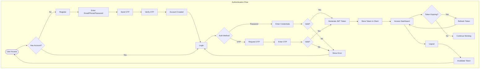

### 1.2 Citizen Management Module

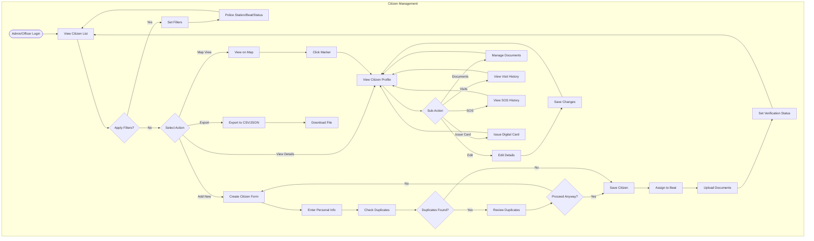

### 1.3 Officer Management Module

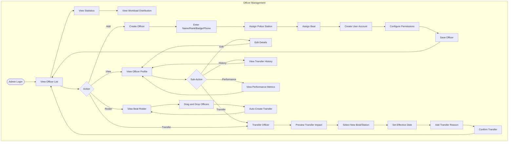

### 1.4 Visit Management Module

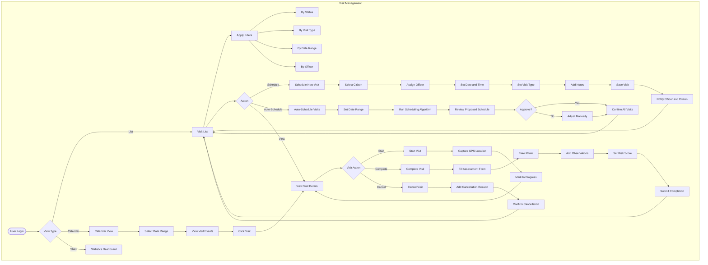

### 1.5 SOS Alert Module

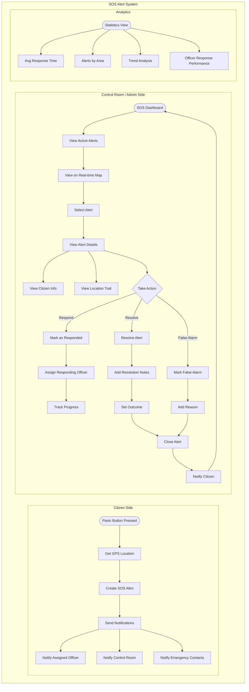

### 1.6 Reports Module

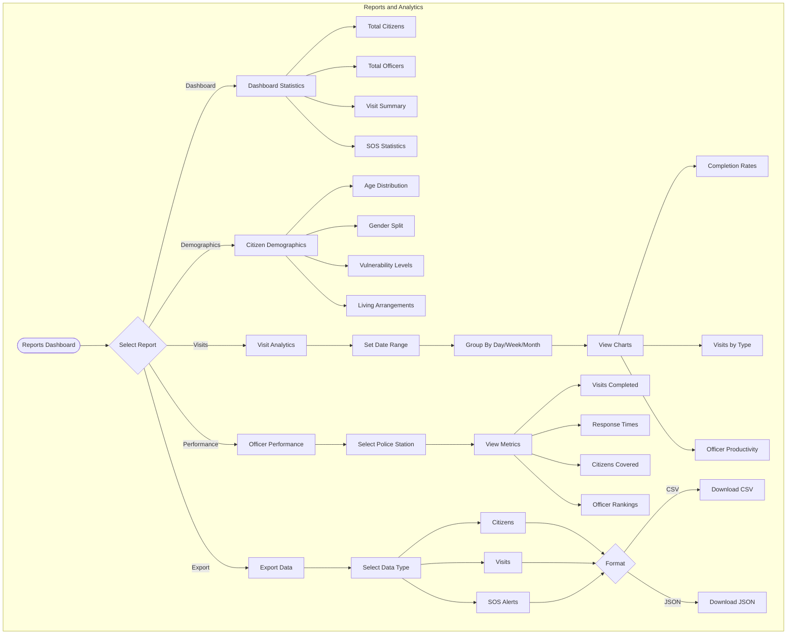

### 1.7 Master Data Module

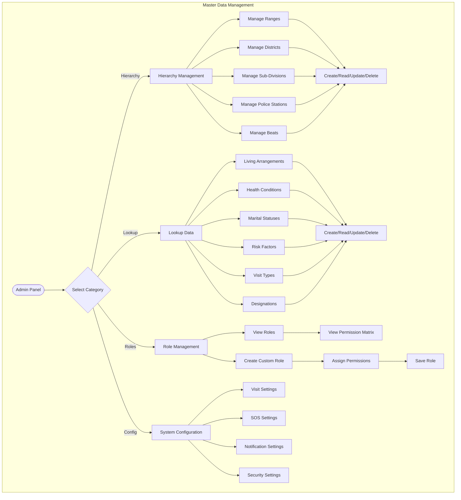

### 1.8 Notification Module

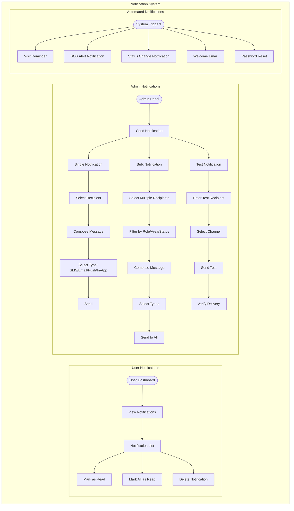

---

## Part 2: Role-wise Workflows

### 2.1 Super Admin Workflow

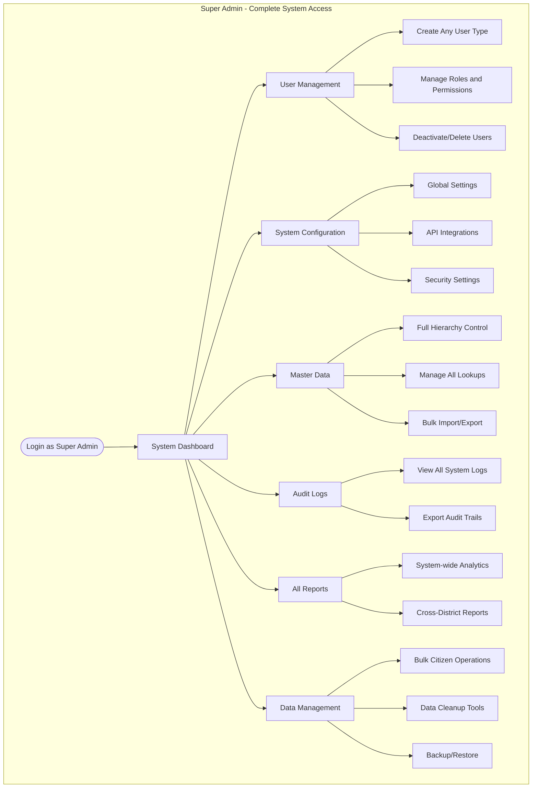

### 2.2 Admin Workflow

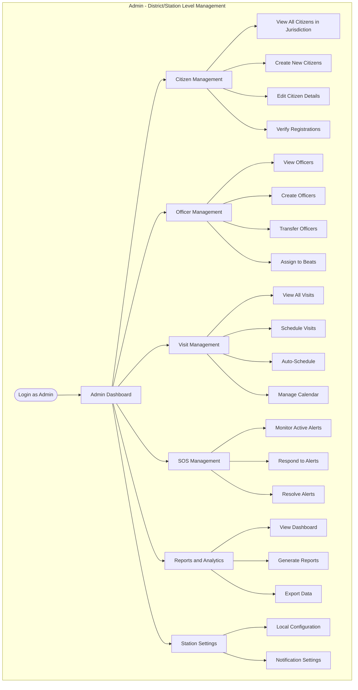

### 2.3 Officer Workflow

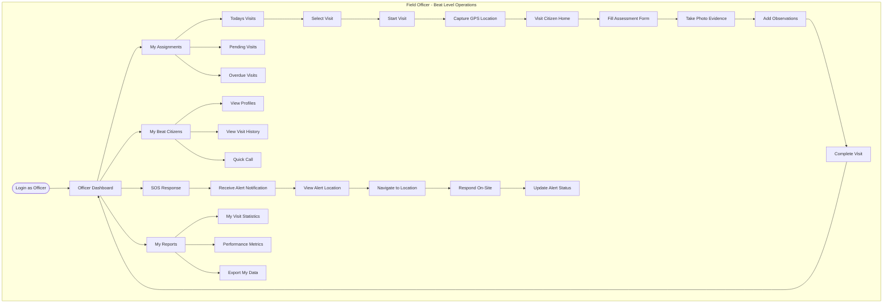

### 2.4 Supervisor Workflow

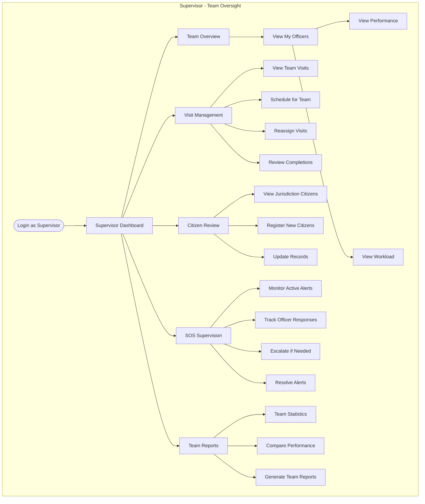

### 2.5 Citizen Self-Service Workflow

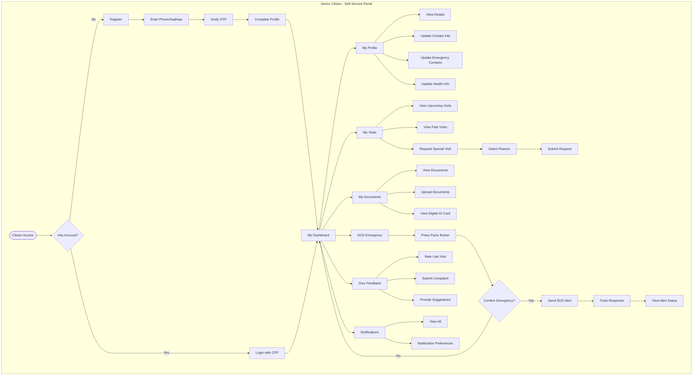

### 2.6 Control Room Workflow

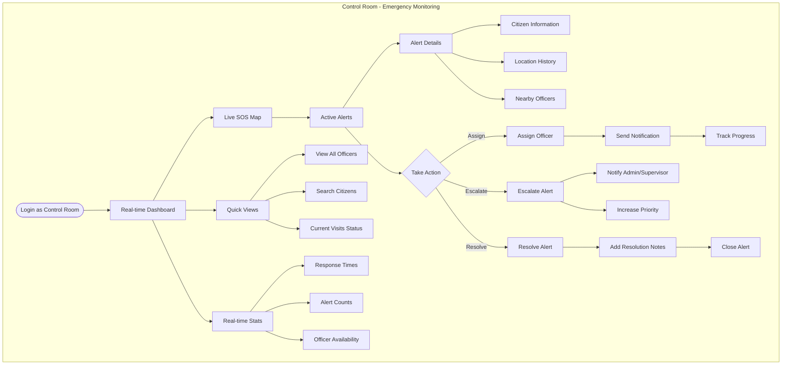

### 2.7 Data Entry Operator Workflow

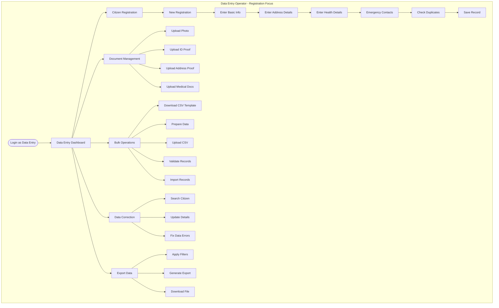

### 2.8 Viewer Workflow

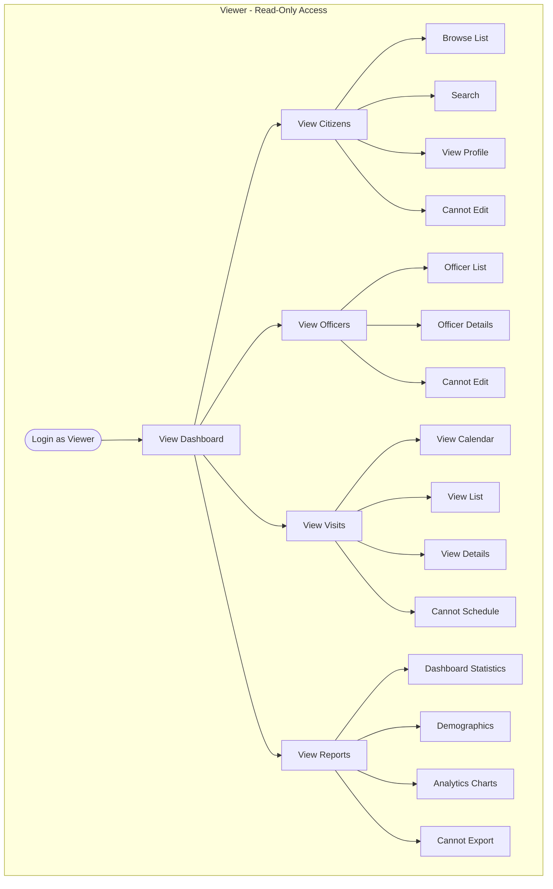

---

## Part 3: Cross-Module Integration Flows

### 3.1 End-to-End Citizen Lifecycle

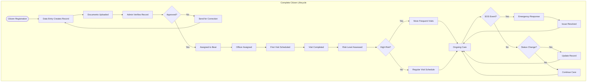

### 3.2 Daily Operations Flow

```mermaid
flowchart TD
    subgraph DailyOps["Daily Operations Flow"]
        Morning([Morning Start]) --> ControlRoom[Control Room Opens]
        ControlRoom --> MonitorDashboard[Monitor Real-time Dashboard]

        Morning --> Officers[Officers Start Day]
        Officers --> ViewAssignments[Check Day Assignments]
        ViewAssignments --> PlanRoute[Plan Visit Route]
        PlanRoute --> StartVisits[Begin Visits]

        StartVisits --> Visit1[Visit Citizen 1]
        Visit1 --> CompleteAssessment[Complete Assessment]
        CompleteAssessment --> NextVisit{More Visits?}
        NextVisit -->|Yes| VisitN[Visit Next Citizen]
        VisitN --> CompleteAssessment
        NextVisit -->|No| EndDay[End of Day]

        MonitorDashboard --> IncomingSOS{SOS Alert?}
        IncomingSOS -->|Yes| AlertOfficer[Alert Nearest Officer]
        AlertOfficer --> OfficerResponds[Officer Responds]
        OfficerResponds --> ResolveEmergency[Resolve Emergency]
        ResolveEmergency --> ResumeVisits[Resume Visits]
        ResumeVisits --> StartVisits
        IncomingSOS -->|No| ContinueMonitor[Continue Monitoring]
        ContinueMonitor --> MonitorDashboard

        EndDay --> SubmitReports[Submit Day Reports]
        SubmitReports --> SupervisorReview[Supervisor Reviews]
        SupervisorReview --> GenerateStats[Generate Daily Stats]
        GenerateStats --> EndOperations([Day Complete])
    end
```

---

## Summary Table: Role Permissions

| Module | Super Admin | Admin | Supervisor | Officer | Citizen | Viewer | Control Room | Data Entry |
|--------|-------------|-------|------------|---------|---------|--------|--------------|------------|
| **Citizens** | Full CRUD | Full CRUD | Read + Write | Read Only | Own Profile | Read | Read | Read + Write |
| **Officers** | Full CRUD | Full CRUD | Read | - | - | Read | Read | - |
| **Visits** | Full CRUD | Full CRUD | Schedule + Complete | Complete Own | Read Own | Read | Read | - |
| **SOS** | Full Access | Full Access | Respond + Resolve | Respond | Create Own | - | Full Access | - |
| **Reports** | All Reports | All Reports | Team Reports | Own Reports | - | View Only | - | Export |
| **System** | Full Config | Local Config | - | - | - | - | - | - |
| **Audit Logs** | Full Access | Full Access | - | - | - | - | - | - |
